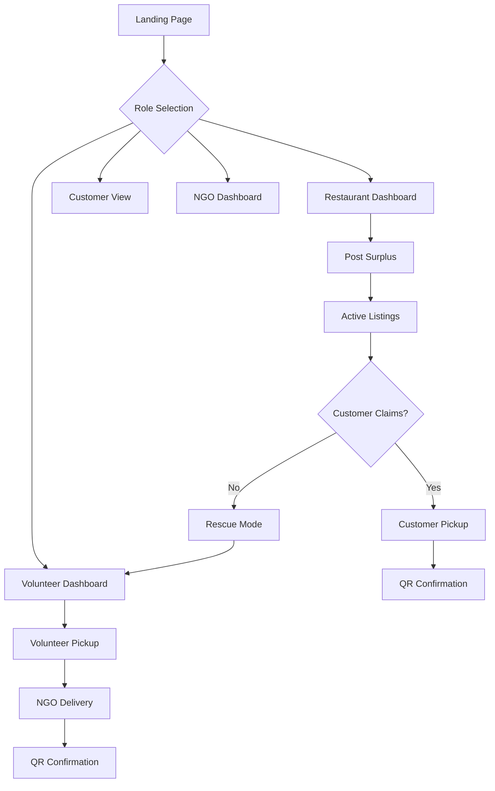

## 1. Product Overview
Surplusly is a full-stack platform that reduces restaurant food waste by redistributing surplus food to nearby customers and, if unclaimed, automatically routing it to volunteers and NGOs for food rescue. The platform bridges the gap between food waste and food insecurity in real time.

**Target Market**: Restaurants with surplus food, cost-conscious consumers, volunteers, and NGOs/food banks in urban areas.

## 2. Core Features

### 2.1 User Roles
| Role | Registration Method | Core Permissions |
|------|---------------------|------------------|
| Restaurant | Business verification required | Post listings, confirm handoffs, view impact metrics |
| Customer | Email/Social login | Browse listings, reserve food, rate experiences |
| Volunteer | Background check required | Accept rescue tasks, confirm pickups/deliveries |
| NGO/Shelter | Location verification required | Receive deliveries, confirm receipts |

### 2.2 Feature Module
Surplusly requirements consist of the following main pages:
1. **Landing Page**: Mission statement, role selection, impact statistics
2. **Restaurant Dashboard**: Post surplus, active listings, QR handoff, impact metrics
3. **Customer View**: Map/list browsing, filters, reservation confirmation
4. **Volunteer Dashboard**: Rescue tasks, navigation, confirmation screens
5. **NGO Dashboard**: Incoming deliveries, capacity settings
6. **Auth & Onboarding**: Sign up, role selection, profile setup

### 2.3 Page Details
| Page Name | Module Name | Feature description |
|-----------|-------------|---------------------|
| Landing Page | Hero Section | Display "Save food. Feed people." messaging with impact statistics and role-based CTAs |
| Landing Page | Impact Metrics | Show real-time counters for meals saved, food rescued (kg), and CO₂ impact |
| Restaurant Dashboard | Post Surplus Form | Input item name, quantity, dietary tags, pickup deadline, optional photo, pricing type |
| Restaurant Dashboard | Active Listings | Display live countdown timers for each listing with status indicators |
| Restaurant Dashboard | QR Handoff | Generate unique QR codes for each reservation, scan to confirm pickup |
| Restaurant Dashboard | Impact Summary | Show total food saved, meals served, and environmental impact statistics |
| Customer View | Map Interface | Interactive map showing nearby listings with distance markers and status |
| Customer View | List View | Alternative list format with filtering by price, distance, dietary requirements |
| Customer View | Listing Detail | Full item description, pickup instructions, countdown timer, reserve button |
| Customer View | Reservation Confirmation | Display QR code, pickup address, time remaining, and cancellation option |
| Volunteer Dashboard | Task Feed | Show rescue tasks sorted by urgency and distance with status indicators |
| Volunteer Dashboard | Task Detail | Navigation instructions, pickup/drop-off addresses, QR scanning interface |
| Volunteer Dashboard | Confirmation Screens | Scan QR codes at pickup and delivery points to confirm completion |
| NGO Dashboard | Incoming Deliveries | List of scheduled deliveries with estimated arrival times |
| NGO Dashboard | Receipt Confirmation | Scan volunteer QR codes to confirm food receipt |
| NGO Dashboard | Capacity Settings | Update availability hours and food acceptance preferences |
| Auth & Onboarding | Sign Up | Role selection, email verification, basic profile creation |
| Auth & Onboarding | Login | Email/password or social media authentication |

## 3. Core Process

### Restaurant Flow
1. Register and verify business credentials
2. Post surplus food with details and pickup deadline
3. Monitor live listings and countdown timers
4. Confirm handoff using QR code when customer/volunteer arrives
5. View impact metrics and food saved statistics

### Customer Flow
1. Browse nearby surplus food on map or list view
2. Filter by dietary needs, price, and distance
3. Reserve listing and receive QR code
4. Pick up food within time window
5. Rate pickup experience

### Volunteer Flow
1. View rescue tasks sorted by urgency and location
2. Accept available rescue task
3. Navigate to restaurant location
4. Scan QR code to confirm pickup
5. Deliver to assigned NGO and scan drop-off QR
6. Earn trust score and view impact stats

### NGO Flow
1. Register location and operating hours
2. Receive notifications of incoming deliveries
3. Confirm receipt via QR code scanning
4. Track total meals received and impact

## 4. User Interface Design

### 4.1 Design Style
- **Primary Colors**: Green (#22C55E) for success/impact, Orange (#F97316) for urgency
- **Secondary Colors**: Neutral grays (#6B7280, #F3F4F6) for backgrounds and text
- **Button Style**: Rounded corners (8px radius), prominent CTAs with hover effects
- **Typography**: Clean sans-serif (Inter or similar), 16px base size
- **Icons**: Simple line icons, food-related emojis for categories
- **Layout**: Card-based design with clear visual hierarchy

### 4.2 Page Design Overview
| Page Name | Module Name | UI Elements |
|-----------|-------------|-------------|
| Landing Page | Hero Section | Full-width green gradient background, large headline text, animated impact counters |
| Restaurant Dashboard | Post Form | Multi-step form with image upload, dropdown menus, time picker |
| Customer View | Map Interface | Google Maps integration with custom pins, listing cards overlay |
| Volunteer Dashboard | Task Feed | Tinder-style card swiping for task acceptance, urgency badges |
| NGO Dashboard | Delivery List | Timeline view with status indicators, capacity toggle switches |

### 4.3 Responsiveness
Desktop-first design with mobile-responsive breakpoints. Touch-optimized interactions for QR scanning and map navigation. Progressive web app capabilities for offline functionality.

### 4.4 Impact Visualization
Real-time counters for meals saved, animated progress bars for environmental impact, and celebratory animations when milestones are reached. Leaderboards for top volunteers and restaurants by impact.