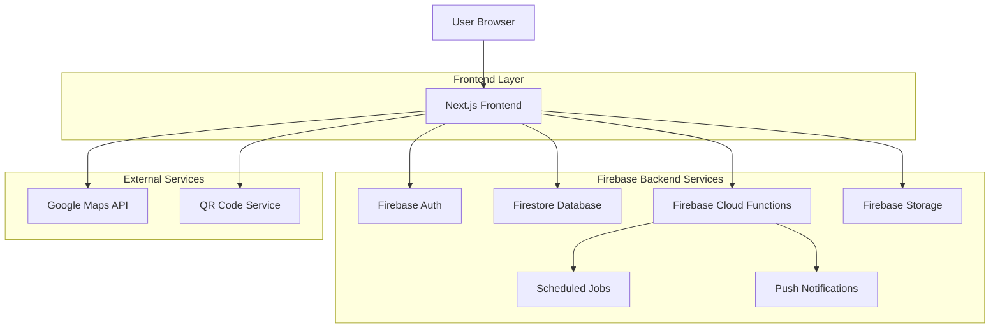
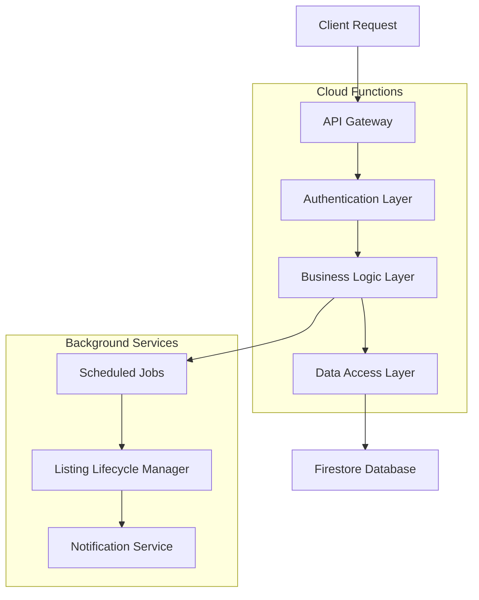
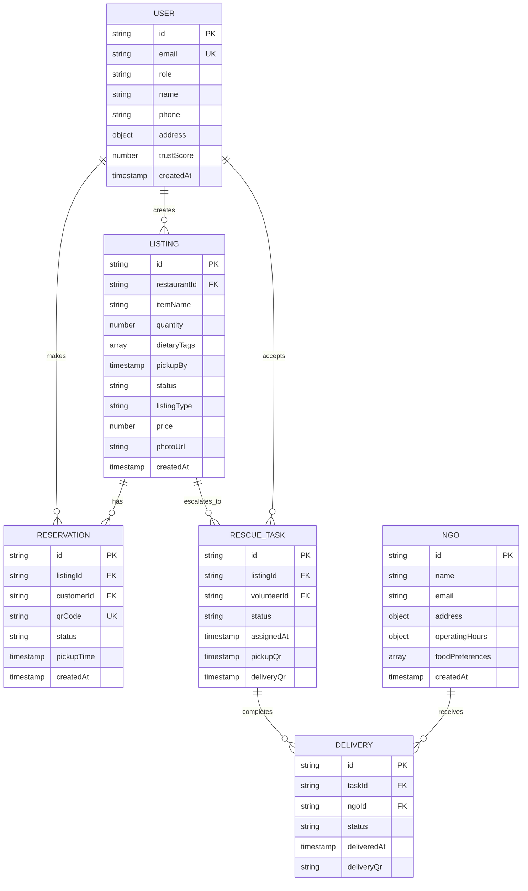

## 1. Architecture Design



## 2. Technology Description
- **Frontend**: Next.js@14 + React@18 + TailwindCSS@3
- **Backend**: Firebase (Auth, Firestore, Cloud Functions, Storage)
- **Database**: Firestore (NoSQL)
- **Maps**: Google Maps JavaScript API
- **QR Codes**: qrcode.react library
- **Push Notifications**: Firebase Cloud Messaging
- **State Management**: React Context + useReducer
- **Form Validation**: React Hook Form + Zod

## 3. Route Definitions
| Route | Purpose |
|-------|---------|
| / | Landing page with mission statement and role selection |
| /auth/signup | User registration with role selection |
| /auth/login | User authentication |
| /restaurant/dashboard | Restaurant management interface |
| /restaurant/post | Create new surplus listing |
| /customer/browse | Map/list view of available food |
| /customer/reservations | User's active reservations |
| /volunteer/dashboard | Rescue task management |
| /ngo/dashboard | Delivery management for NGOs |
| /profile | User profile and settings |
| /impact | Platform-wide impact statistics |

## 4. API Definitions

### 4.1 Authentication APIs
```
POST /api/auth/register
```
Request:
```json
{
  "email": "string",
  "password": "string",
  "role": "restaurant|customer|volunteer|ngo",
  "name": "string",
  "phone": "string",
  "address": "object" // for restaurants/ngos
}
```

```
POST /api/auth/login
```
Request:
```json
{
  "email": "string",
  "password": "string"
}
```

### 4.2 Listing Management APIs
```
POST /api/listings/create
```
Request:
```json
{
  "itemName": "string",
  "quantity": "number",
  "dietaryTags": ["string"],
  "pickupBy": "timestamp",
  "listingType": "discounted|donation",
  "price": "number", // optional
  "photoUrl": "string", // optional
  "restaurantId": "string"
}
```

```
GET /api/listings/nearby
```
Query Parameters:
- lat: number
- lng: number
- radius: number (meters)
- dietaryFilters: string[]
- maxPrice: number

### 4.3 Reservation APIs
```
POST /api/reservations/create
```
Request:
```json
{
  "listingId": "string",
  "userId": "string",
  "pickupTime": "timestamp"
}
```

```
POST /api/reservations/confirm-pickup
```
Request:
```json
{
  "reservationId": "string",
  "qrCode": "string"
}
```

### 4.4 Rescue Task APIs
```
POST /api/rescue/accept-task
```
Request:
```json
{
  "taskId": "string",
  "volunteerId": "string"
}
```

```
POST /api/rescue/confirm-pickup
```
Request:
```json
{
  "taskId": "string",
  "pickupQr": "string",
  "timestamp": "timestamp"
}
```

## 5. Server Architecture Diagram



## 6. Data Model

### 6.1 Data Model Definition


### 6.2 Data Definition Language

**Users Collection**
```javascript
// Firestore collection: users
docId: {
  email: string,
  role: 'restaurant' | 'customer' | 'volunteer' | 'ngo',
  name: string,
  phone: string,
  address: {
    street: string,
    city: string,
    state: string,
    zipCode: string,
    coordinates: {
      latitude: number,
      longitude: number
    }
  },
  trustScore: number, // 0-100
  impactStats: {
    mealsSaved: number,
    foodRescuedKg: number,
    co2Saved: number
  },
  createdAt: timestamp,
  updatedAt: timestamp
}
```

**Listings Collection**
```javascript
// Firestore collection: listings
docId: {
  restaurantId: string, // reference to users
  itemName: string,
  quantity: number,
  dietaryTags: string[], // 'vegan', 'halal', 'gluten-free', etc.
  pickupBy: timestamp,
  status: 'live' | 'rescue_mode' | 'assigned' | 'picked_up' | 'delivered' | 'expired',
  listingType: 'discounted' | 'donation',
  price: number, // optional for discounted items
  photoUrl: string, // optional
  location: {
    address: object,
    coordinates: {
      latitude: number,
      longitude: number
    }
  },
  createdAt: timestamp,
  updatedAt: timestamp
}
```

**Reservations Collection**
```javascript
// Firestore collection: reservations
docId: {
  listingId: string, // reference to listings
  customerId: string, // reference to users
  qrCode: string, // unique QR code
  status: 'active' | 'completed' | 'cancelled' | 'expired',
  pickupTime: timestamp,
  createdAt: timestamp
}
```

**Scheduled Cloud Functions**
```javascript
// Function to automatically escalate listings to rescue mode
exports.escalateToRescueMode = functions.pubsub
  .schedule('every 5 minutes')
  .onRun(async (context) => {
    // Query listings that need escalation
    // Update status to 'rescue_mode'
    // Notify volunteers
  });

// Function to clean up expired listings
exports.cleanupExpiredListings = functions.pubsub
  .schedule('every hour')
  .onRun(async (context) => {
    // Mark expired listings
    // Update statistics
  });
```

**Security Rules**
```javascript
// Firestore security rules
rules_version = '2';
service cloud.firestore {
  match /databases/{database}/documents {
    // Users can only read/write their own profile
    match /users/{userId} {
      allow read: if request.auth != null && request.auth.uid == userId;
      allow create: if request.auth != null;
      allow update: if request.auth != null && request.auth.uid == userId;
    }
    
    // Listings are public for reading
    match /listings/{listingId} {
      allow read: if request.auth != null;
      allow create: if request.auth != null && 
        request.auth.token.role == 'restaurant';
      allow update: if request.auth != null && 
        (request.auth.token.role == 'restaurant' || 
         request.auth.token.role == 'volunteer');
    }
    
    // Reservations
    match /reservations/{reservationId} {
      allow read: if request.auth != null && 
        (request.auth